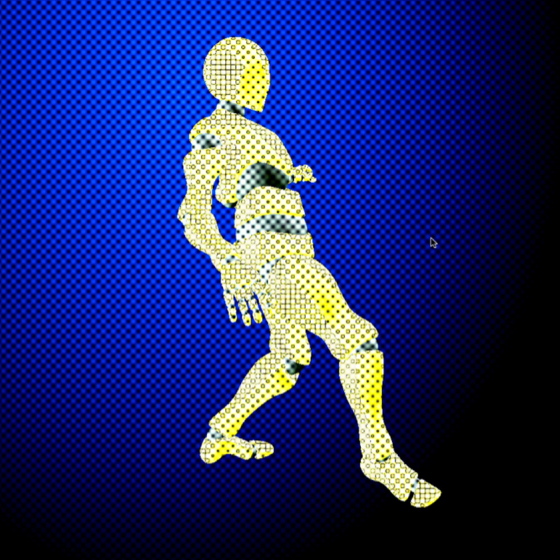

# Three.js + WebGPU Post-Processing Effects

In this beginner-friendly project, we'll leverage the WebGPU renderer in Three.js and layer post-processing passes step by step. Along the way we’ll sharpen the essentials like asset loading, TSL operators and animation so you can create amazing 3D on the web. Start here, then level up effect-by-effect. If it helps, drop a sub and explore my other tutorials/resources.

Watch the tutorial on [YouTube](https://youtu.be/KeJV_3LzXIA)




```sh
# Clone the repository
git clone https://github.com/bobbyroe/Post-processing-with-TSL.git
cd Post-processing-with-TSL
```

## Usage
Run a local server to serve the project:

```sh
npx http-server
```
or fire up Live Server

Then open `http://localhost:8080` (or the appropriate URL) in your browser.

## Dependencies
- [Three.js](https://threejs.org/) (WebGPU Renderer, Orbit Controls)
- Node.js (optional, for serving files locally)

## Development
Modify `index.js` to experiment with different Three.js objects, materials, or effects.

## License
This project is licensed under the MIT License. Feel free to modify and distribute.

